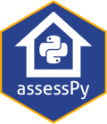

# AssessPy <a href="https://github.com/ccao-data/assesspy"></a>

[](https://github.com/ccao-data/assesspy/actions/workflows/python-package.yaml)
[](https://github.com/ccao-data/assesspy/actions/workflows/test-coverage.yaml)
[](https://github.com/ccao-data/assesspy/actions/workflows/pre-commit.yaml)
[](https://codecov.io/gh/ccao-data/assesspy)

AssessR is a software package for R developed by the Cook County Assessor’s (CCAO) Data Department. 
This package is used in the CCAO’s custom-built [Automated Valuation Model (AVM)](https://github.com/ccao-data/model-res-avm). 
The codebase for the CCAO’s AVM uses a wide range of functions regularly, 
and packaging these functions streamlines and standardizes their use.

For assessors, we believe that this package will reduce the complexity of calculating 
ratio statistics and detecting sales chasing. We also hope that reporters, taxpayers, 
and members of academia will find this package helpful in monitoring the performance 
of local assessors and conducting research.

For detailed documentation on included functions and data, [**visit the
full reference
list**](https://ccao-data.github.io/assesspy/reference.html).

For examples of specific tasks you can complete with `assesspy`
functions, see the [**vignettes
page**](https://ccao-data.github.io/assesspy/vignettes.html).

## Installation

You can install the released version of `assesspy` using pip.

```python
pip install assesspy
```

Once it's installed, you can use it just like any other package. Simply
call `import assesspy` at the beginning of your script.
